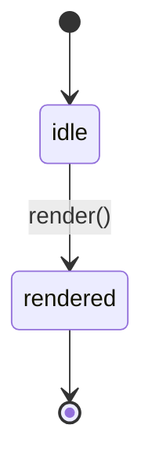

# About Widgets

A widget renders one value. This chapter explains the model.

**Read this chapter if** you are new to widgets.

## About Widgets

**Figure 1-1: A widget moves from idle to rendered.**



| State | Meaning |
|---|---|
| `idle` | Created, not yet drawn |
| `rendered` | Drawn at least once |

```ts
const widget = createWidget({ value: 42 });
await widget.render();
```

> [!WARNING]
> Do not call `render()` after `dispose()`. The widget has released its canvas, so the call throws.

## Summary

- Widgets are idle until rendered.
